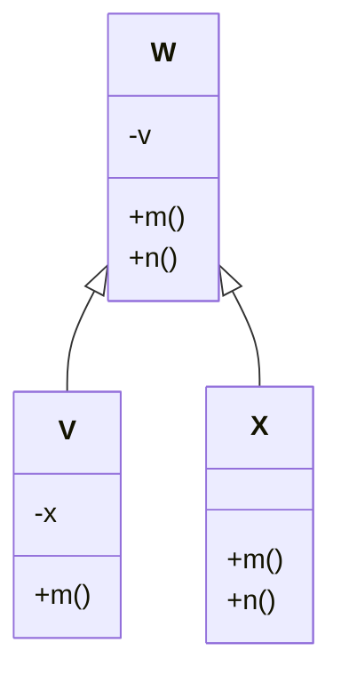

# OO Testing Challenges

## 1. Levels of OO Testing

Testing OO software involves multiple levels beyond simple unit testing:

- **Intra-method**: Testing within one method (covered by standard techniques).
- **Inter-method**: Testing interactions between methods *in the same class*.
- **Intra-class**: Testing a single class as a unit, often via sequences of method calls.
- **Inter-class**: Testing interactions *between different classes*.

This module focuses on **intra-class** and **inter-class** testing challenges.

## 2. The Core Challenge: Polymorphism & Dynamic Binding

The main difficulty in OO testing comes from features like **inheritance** and **polymorphism**, which lead to **dynamic binding**.

- **Problem**: You often cannot know *at compile time* which specific version of an overridden method will execute. The call `object.method()` might execute the version in the declared class or any version in a descendant class, depending on the object's *actual type* at runtime.

- **Polymorphic Call Set**: The set of all methods (across the inheritance hierarchy) that could potentially be executed by a single polymorphic call site.

## 3. Visualizing OO Interactions: The Yo-Yo Graph

Because call sequences can be complex and hard to predict, the **Yo-Yo Graph** is used as a visualization tool.

- **Concept**: It's a call graph adapted for inheritance hierarchies. The name comes from how the execution path can "bounce" up and down the hierarchy (Parent → Child → Grandchild → Child → Parent...).

- **Structure**:
  - Nodes represent **methods** within each class of the hierarchy.
  - Edges represent potential **method calls**.
  - Different edge styles (e.g., bold vs. dashed) show the *actual* call path for a specific object type versus potential calls blocked by overriding.

- **Purpose**: Helps testers visualize the complex, dynamic call sequences to identify potential integration issues and data flow anomalies that might otherwise be missed.

- **Example**: Yo-Yo Graph showing class hierarchy A ← B ← C

    ```mermaid
    graph TB
        subgraph "Class A"
            Ad[d]
            Ag[g]
            Ah[h]
            Ai[i]
            Aj[j]
            Al[l]
        end
        
        subgraph "Class B extends A"
            Bh[h]
            Bi[i]
            Bk[k]
        end
        
        subgraph "Class C extends B"
            Ci[i]
            Cj[j]
            Cl[l]
        end
        
        Ad --> Ag
        Ag --> Ah
        Ah -.-> Ai
        Ai --> Aj
        
        Ag ==> Bh
        Bh ==> Ci
        Ci ==> Bi
        Bi ==> Ai
        Ai ==> Cj
        Cj ==> Bk
        Bk ==> Cl
        
        style Ad fill:#4a90e2,stroke:#333,color:#fff
        style Ag fill:#4a90e2,stroke:#333,color:#fff
        style Ah fill:#4a90e2,stroke:#333,color:#fff
        style Ai fill:#4a90e2,stroke:#333,color:#fff
        style Aj fill:#4a90e2,stroke:#333,color:#fff
        style Al fill:#4a90e2,stroke:#333,color:#fff
        style Bh fill:#d946a6,stroke:#333,color:#fff
        style Bi fill:#d946a6,stroke:#333,color:#fff
        style Bk fill:#d946a6,stroke:#333,color:#fff
        style Ci fill:#65a30d,stroke:#333,color:#fff
        style Cj fill:#65a30d,stroke:#333,color:#fff
        style Cl fill:#65a30d,stroke:#333,color:#fff
    ```

- This shows calls between methods `d, g, h, i, j, l, k` across classes A, B, and C.
- Bold arrows show the actual path if the object is type C, bouncing between levels.
- Dashed arrows show calls that *don't* happen due to overriding.

## 4. Class Hierarchy and Method Overriding Example



**Code example:**
```java
void f(boolean b) {
    W o;
    ...
    if (b)
        o = new V();
    else
        o = new W();
    ...
    o.m();
}
```

**Key points:**
- V and X extend W, V overrides method `m()` and X overrides methods `m()` and `n()`
- `-`: attributes are private, `+`: attributes are non-private
- The declared type of `o` is W, but at line 10, the actual type can be either V or W
- Since V overrides `m()`, which version of `m()` is executed depends on the input flag to the method

## 5. Data Flow Anomalies with Polymorphism

Looking at the class hierarchy A ← B ← C, we can analyze def-use relationships:

| Method | Defs | Uses |
|--------|------|------|
| A::h | {A::u, A::w} | |
| A::i | | {A::u} |
| A::j | {A::v} | {A::w} |
| A::l | | {A::v} |
| B::h | {B::x} | |
| B::i | | {B::x} |
| C::i | {C::y} | |
| C::j | | {C::y} |
| C::l | | {A::v} |

This table shows which methods define (Defs) and use (Uses) which variables across the class hierarchy, helping identify potential data flow anomalies.

## 6. Common OO Fault Categories

Polymorphism and inheritance can lead to specific types of faults, often related to state management and data flow.

*(Assumption: Faults manifest when a descendant object is used where an ancestor is expected)*

### I. Inconsistent Type Use (ITU)

- **Cause**: A descendant $C$ extends an ancestor $T$ by adding *new* methods but *doesn't override* any. An object is used sometimes as $C$, sometimes as $T$.

- **Anomaly**: A method call using the object *as type $T$* changes the object's state in a way that violates assumptions made by the *new methods in $C$*.

- **Example (Stack/Vector)**:

    ```mermaid
    classDiagram
        class Vector {
            array
            +insertElementAt()
            +removeElementAt()
        }
        
        class Stack {
            +pop() Object
            +push() Object
        }
        
        Vector <|-- Stack
    ```

**Code example:**
```java
s.push("string1");
s.push("string2");
s.push("string3");
dumb(s);
pop();
pop();
pop(); // Stack is empty

void dumb(Vector v) {
    v.removeElementAt(v.size()-1);
}
```

**The fault:**
- Class `Vector` is a sequential data structure that supports direct access to its elements
- Class `Stack` uses methods inherited from `Vector` to implement the stack
- `Stack` extends `Vector`. `push/pop` use `Vector` methods
- Code pushes 3 items onto `Stack s`. `s` thinks its size is 3
- `s` is passed to `dumb(Vector v)`. `dumb` calls `v.removeElementAt()` directly, removing an item
- `Stack` is unaware. Later `pop()` calls fail because the state is inconsistent

### II. State Definition Anomaly (SDA)

- **Cause**: An *overriding* method in a descendant fails to define a state variable that the original *overridden* ancestor method *did* define.

- **Anomaly**: If the descendant's overriding method is called, a later method (expecting the variable to be defined) might encounter a data flow anomaly (use of undefined variable).

- **Example (W/X/Y - SDA)**:

    ```mermaid
    classDiagram
        class W {
            +v
            +u
            +m()
            +n()
        }
        
        class X {
            +x
            +n()
        }
        
        class Y {
            +w
            +m()
        }
        
        W <|-- X
        X <|-- Y
    ```

**Key facts:**
- `W::m()` defines `v` and `W::n()` uses `v`
- `X::n()` uses `v`
- `Y::m()` does NOT define `v`

**Fault**: For an object of actual type Y, a data flow anomaly exists if `m()` is called, then `n()`. 
- `Y::m()` runs (doesn't define `v`)
- `X::n()` runs and uses undefined `v`

### III. State Definition Inconsistency due to Hiding (SDIH)

- **Cause**: A descendant $Y$ declares a *local* variable with the same name as an *inherited* variable `v` from ancestor $W$, effectively **hiding** `W.v`. $Y$ also overrides a method `m()` that was supposed to define `W.v`.

- **Anomaly**: The overriding method `Y::m()` now defines the *local* `Y.v` instead of the *inherited* `W.v`. Another inherited or sibling method `n()` that expects `W.v` to be defined will encounter a data flow anomaly.

- **Example (W/X/Y - SDIH)**:

    ```mermaid
    classDiagram
        class W {
            +v
            +u
            +m()
            +n()
        }
        
        class X {
            +x
            +n()
        }
        
        class Y {
            +v (hides W's v)
            +m()
        }
        
        W <|-- X
        X <|-- Y
    ```

**Key facts:**
- Y overrides W's `v`
- `Y::m` defines `Y::v`
- `X::n` uses `v`, getting W's version of `v`

**Fault**: For an object of actual type Y, a data flow anomaly exists if `m()` is called, then `n()`.
- `Y::m()` runs and defines `Y::v` (not `W::v`)
- `X::n()` runs and uses `W::v`, which was never defined

### IV. State Visibility Anomaly (SVA)

- **Cause**: An ancestor $W$ declares a state variable `v` as **private**. A method `W::m()` defines `v`. A descendant $Y$ overrides `m()`.

- **Anomaly**: The overriding method `Y::m()` attempts to call `super.m()` (i.e., `W::m()`) to get `v` defined. This fails or causes unexpected behavior because `v` is **private** to $W$ and completely inaccessible/invisible to $Y$, even via `super`.

- **Example (W/X/Y - SVA)**:

    ```mermaid
    classDiagram
        class W {
            -v
            +m()
        }
        
        class X {
        }
        
        class Y {
            +m()
        }
        
        W <|-- X
        X <|-- Y
    ```

**Key facts:**
- `W::m()` defines `v`
- `Y::m()` cannot call `W::m()`

**The issue**: `Y::m()` overrides `W::m()` but cannot access private `v` from W, even through inheritance.

### V. Other Faults Mentioned

- **State Defined Incorrectly (SDI)**: Overriding method computes the same state variable differently/incorrectly.

- **Indirect Inconsistent State Definition (IISD)**: A *new* (extension) method in a descendant defines an inherited state variable, potentially causing inconsistencies.
