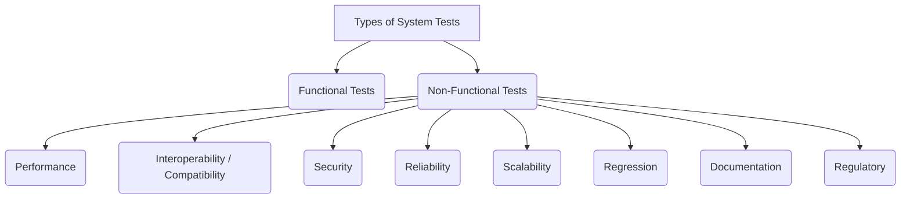

# Non-Functional System Testing

While most of the course focused on *functional* testing (Does it work?), this covers *non-functional* testing (How *well* does it work?). This usually happens at the **system testing** level.

## 1. Taxonomy of Non-Functional Tests

Here are common types (not a complete list):

- **Interoperability / Compatibility Testing**:
  - Can the system work correctly with other third-party products, platforms (OS, browsers, databases)?
  - Includes **Forward Compatibility** (an older system/version correctly handles data/interactions from a newer version) and **Backward Compatibility** (a newer version correctly handles data/interactions from an older version).

- **Security Testing**: Does the system protect data and maintain security? Checks:
  - **Confidentiality** (prevent unauthorized access).
  - **Integrity** (prevent unauthorized changes).
  - **Availability** (prevent denial of service).
  - Authentication, Authorization, Encryption, Virus Checks, Back Doors (e.g., buffer overflows).

- **Reliability Testing**: Can the system operate without failure for a specified time? (Often involves statistics)

- **Scalability Testing**: Can the system handle increasing load (users, data) while meeting performance goals? Identifies bottlenecks (CPU, network, storage).

- **Documentation Testing**: Is the user manual, help text, etc., accurate, clear, and useful? Involves:
  - **Read Test**: Review for clarity, grammar, consistency.
  - **Hands-on Test**: Use help features, check error messages.
  - **Functional Test**: Follow instructions exactly to see if the system behaves as documented. Check index, glossary, install steps.

- **Regulatory Testing**: Does the system meet legal or industry standards (e.g., CE, FCC, safety standards like DO-178C for aviation)? Often requires specific processes and extensive documentation.

- **Performance Testing** (See below).

- *(Usability/GUI testing often considered non-functional but not detailed here)*.

## 2. Performance Testing Deep Dive ⏱️

Evaluates system **responsiveness** and **stability** under various workloads.

### I. Types of Performance Tests

- **Load Testing**: Simulate *expected* user load (normal and peak) to measure performance. Are response times acceptable?

- **Stress Testing**: Find the **breaking point**. Increase load *beyond* expected maximum until the system fails, to identify upper limits and failure modes.

- **Soak Testing (Endurance Testing)**: Run a moderate, expected load for a *long period* (hours or days). Checks for problems like memory leaks or resource exhaustion.

- **Spike Testing**: Simulate *sudden, sharp increases* in load (e.g., ticket sales opening) to see if the system recovers.

- **Think of it like this**: Load testing is checking if a bridge can handle rush hour traffic. Stress testing is seeing how many trucks you can pile on before it collapses. Soak testing is leaving traffic on it for a week to see if it develops cracks. Spike testing is suddenly dropping 100 cars on it at once.

### II. Goals & Metrics

- **Goals**: Prove requirements met, compare systems, find bottlenecks.

- **Key Metrics**:
  - **Response Time**: How long does an operation take?
  - **Throughput**: How many operations per second?
  - **Concurrent Users**: How many users can the system support?
  - Resource Utilization (CPU, memory, network).

### III. Tools

Specialized tools are needed to simulate load and monitor results (e.g., HP LoadRunner, Apache JMeter, Gatling).
