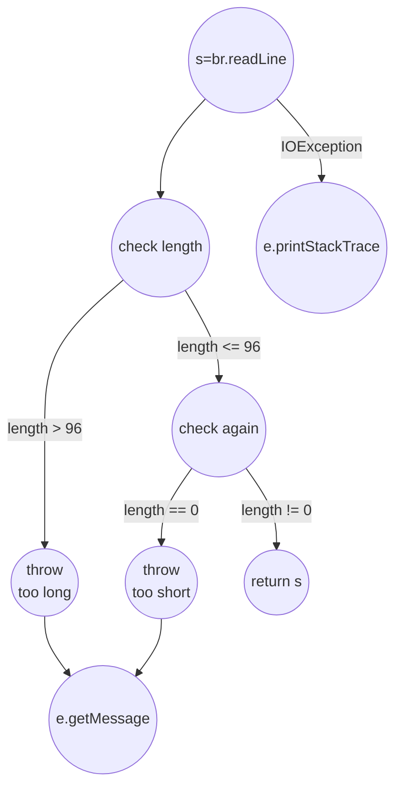

# Classical Testing Concepts

These are older, traditional terms that are equivalent to the graph coverage ideas.

- **Statement Coverage** is the same as **Node Coverage (NC)**.
- **Branch Coverage** is the same as **Edge Coverage (EC)**.
- **Loop Coverage** is what **Prime Path Coverage (PPC)** is designed to achieve.

## Cyclomatic Complexity

- A number that measures the structural complexity of a program. It is calculated from the CFG and represents the number of fundamental, linearly independent paths. A path is considered linearly independent if it includes at least one new edge that isn't part of any other linearly independent paths.
- **Simple Formula**: For a single method, it's just **`Number of Decisions + 1`**.
- A complexity score under 10 is usually considered good.

## Basis Path Testing

- A technique where you use the cyclomatic complexity number to identify a fundamental set of paths.
- The goal is to create tests that execute each of these paths, which guarantees you'll achieve Branch Coverage.
- It's very similar to **Prime Path Coverage**.

## Example: Exception Handling (try-catch) CFG

**Code:**
```java
try {
    s = br.readLine();
    if (s.length() > 96) {
        throw new Exception("too long");
    }
    if (s.length() == 0) {
        throw new Exception("too short");
    }
} catch (IOException e) {
    e.printStackTrace();
} catch (Exception e) {
    e.getMessage();
}
return s;
```

**CFG:**

