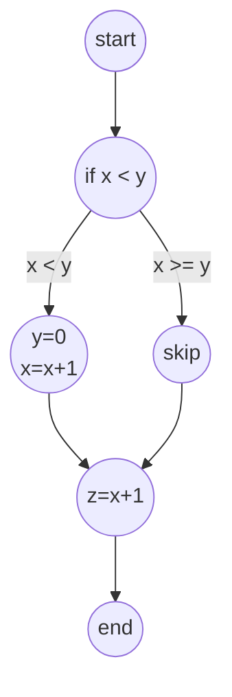
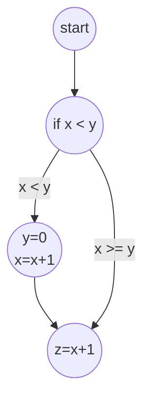
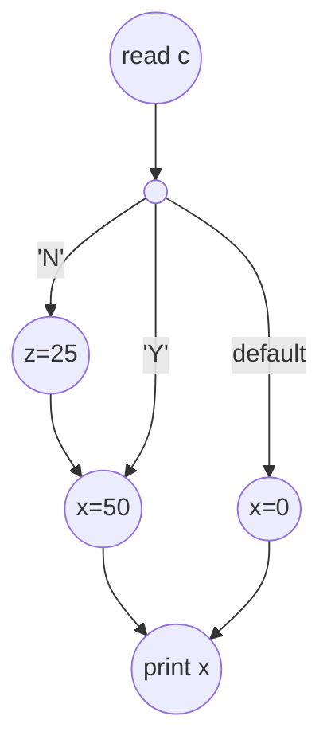
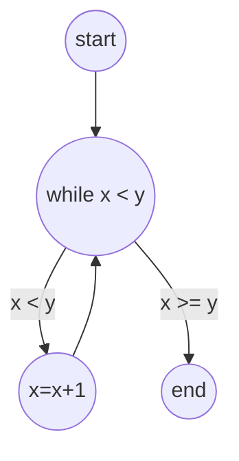
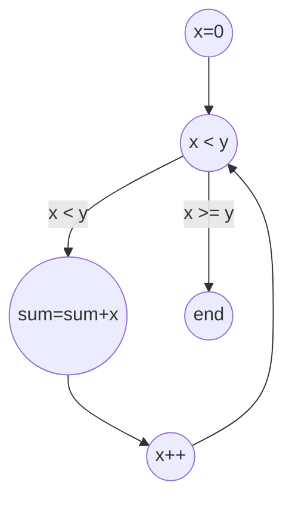
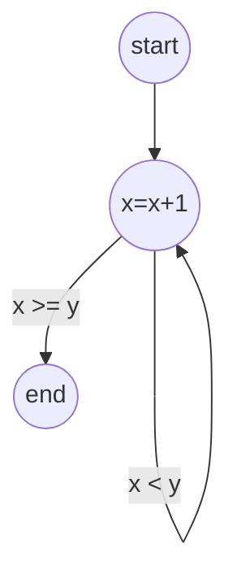
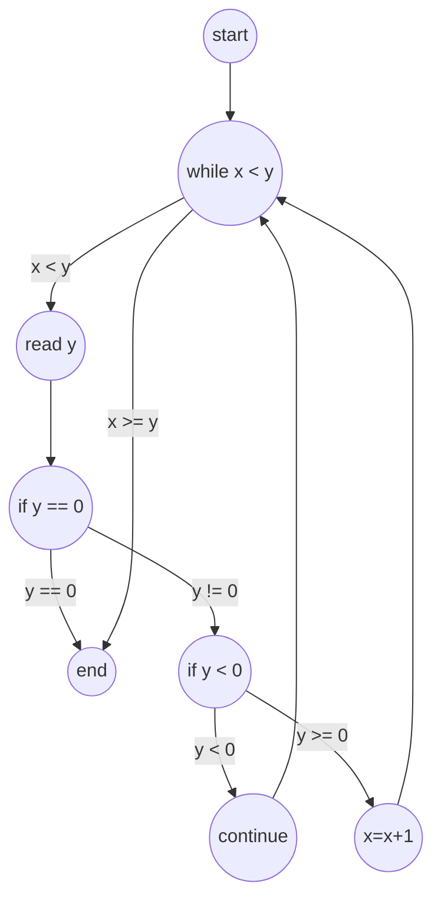

# Graph Coverage for Source Code

## Paths and Reachability

- **Simple Path**: A path that does not contain any repeated nodes. The only exception is that the first and last node can be the same (which forms a cycle).

## Modeling Code as Control Flow Graphs (CFGs)

- A **Control Flow Graph (CFG)** is a simple map of all possible paths through a piece of code. It's the most common way we model code for testing.
- **Nodes**: Circles representing basic blocks of code (lines that always run together).
- **Edges**: Arrows showing the flow from one block to another (e.g., an `if` branching or a loop).

### CFGs for Common Code Structures

#### If-Else Statement
A choice point. The `true` path goes one way, the `false` path goes another, and then they join back together.

**Code:**
```java
if (x < y) {
    y = 0;
    x = x + 1;
}
z = x + 1;
```

**CFG:**


#### If Statement (No Else)
The `false` path just skips the `if` block and goes straight to the next part.

**Code:**
```java
if (x < y) {
    y = 0;
    x = x + 1;
}
z = x + 1;
```

**CFG:**


#### Switch-Case Statement
One entry point splits into many paths. If a `case` is missing a `break`, it "falls through" to the next one, which is shown with an extra arrow.

**Code:**
```java
char c = readChar();
switch (c) {
    case 'N':
        z = 25;
        // falls through (no break)
    case 'Y':
        x = 50;
        break;
    default:
        x = 0;
}
print(x);
```

**CFG:**


#### While Loop
A check happens at the beginning. If true, the loop body runs and then goes back to the check. If false, the loop is skipped.

**Code:**
```java
while (x < y) {
    x = x + 1;
}
```

**CFG:**


#### For Loop
This is like a `while` loop but with built-in setup and update steps, which are shown as separate nodes in the graph.

**Code:**
```java
for (x = 0; x < y; x++) {
    sum = sum + x;
}
```

**CFG:**


#### Do-While Loop
The code inside the loop always runs at least once *before* the condition is checked at the end.

**Code:**
```java
do {
    x = x + 1;
} while (x < y);
```

**CFG:**


#### Loops with `break` and `continue`
- **`break`**: Creates an edge that jumps completely out of the loop.
- **`continue`**: Creates an edge that skips the rest of the loop's body and goes back to the condition check.

**Code:**
```java
while (x < y) {
    y = readInt();
    if (y == 0) {
        break;  // exit loop
    }
    if (y < 0) {
        continue;  // skip to next iteration
    }
    x = x + 1;
}
```

**CFG:**

