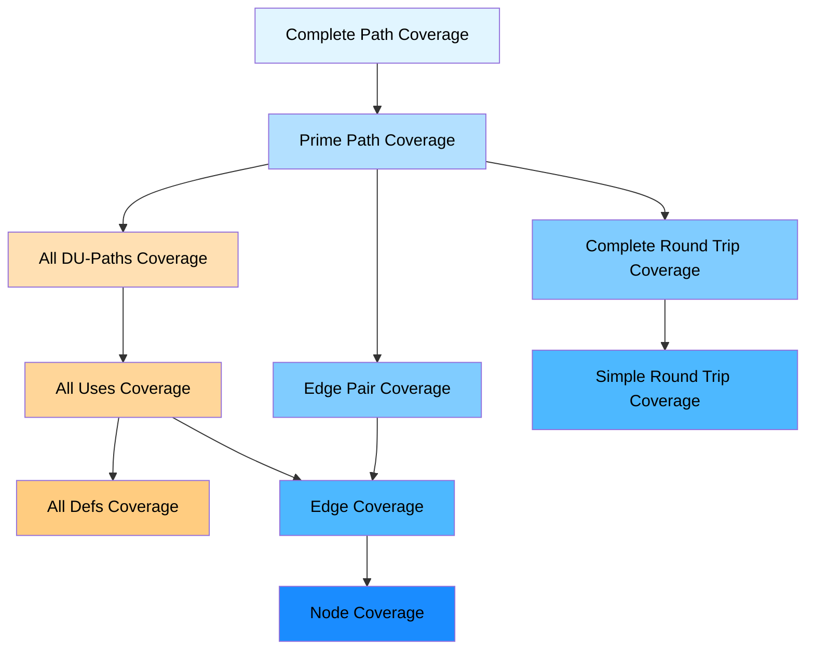
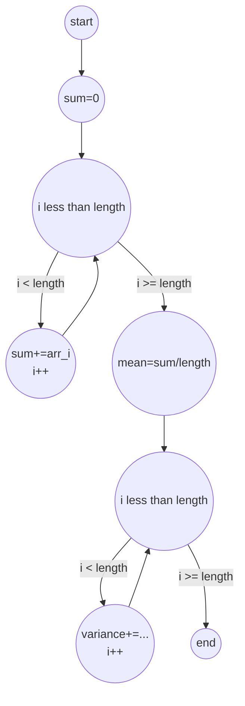
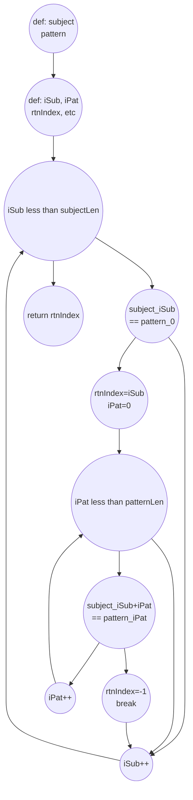

# Structural and Data Flow Coverage

## Structural Coverage Criteria (Testing the Map)

These criteria tell us what parts of the CFG we need to cover with our tests.

- **Node Coverage (NC)**: Make sure every node (statement) is executed at least once. This is the weakest coverage.
- **Edge Coverage (EC)**: Make sure every edge (branch) is traversed at least once. This tests both `true` and `false` outcomes of decisions.
- **Edge-Pair Coverage (EPC)**: Test every sequence of two adjacent edges. This is even stronger because it checks the interaction between consecutive branches.
- **Prime Path Coverage (PPC)**: This is a powerful way to test loops. It requires you to test all **prime paths**. A prime path is a simple path that isn't part of a longer simple path. In practice, this means your tests will cover three important loop scenarios:
  1. Skipping the loop entirely.
  2. Running the loop exactly once.
  3. Running the loop multiple times.

### Data Flow Coverage (Testing the Variables)

Data flow coverage focuses on the life of variables: from creation to use.

#### Core Concepts

- **Definition (Def)**: Where a variable gets a value (e.g., `x = 10;`).
- **Use**: Where a variable's value is read (e.g., `y = x + 5;`).

### Important Data Flow Rules

- **A single statement can be both a def and a use**: For a statement like `x = x + 1;` or `w = 2 * w;`:
  - The `x` (or `w`) on the **right side** is a **use** (its old value is read).
  - The `x` (or `w`) on the **left side** is a **def** (it gets a new value).
- **Killed Definitions**: A `def` is **killed** if the variable is defined again before its value can be used. This is why not every `def` is guaranteed to reach a `use`. A DU-path must be "def-clear," meaning the variable is not killed along the path.

#### DU Paths

- **DU Path**: A path from a **Def** to a **Use** where the variable is not redefined in between.
- **A Def is killed** if the variable is redefined before it can reach a Use. This is why not every Def is guaranteed to reach a Use.

#### Grouping DU Paths

- To create test requirements, DU-paths for a variable are typically grouped based on their **starting definition point (Def)**. This is a key principle for defining data flow criteria.

### Grouping DU Paths for Testing

- To create test requirements for data flow criteria, DU-paths for a given variable are typically grouped based on their **starting definition point (Def)**. For example, all DU-paths that start from the definition of `x` at line 5 would be in one group.

#### Data Flow Criteria

1. **All Defs Coverage (ADC)**: The weakest criterion. For every variable **Def**, you must test at least one path to one of its **Uses**.
2. **All Uses Coverage (AUC)**: Stronger. For every variable **Def**, you must test a path to **every possible Use**.
3. **All DU Paths Coverage (ADPC)**: The strongest. For every **Def-Use Pair**, you must test **every possible simple path** between the Def and the Use.

### Subsumption Hierarchy (Which is Strongest?)

If you satisfy a criterion, you automatically satisfy the ones below it. The general order from strongest to weakest is:

- **Strongest**: Prime Path Coverage & All DU Paths Coverage
- **Medium**: Edge-Pair Coverage & All Uses Coverage
- **Weaker**: Edge Coverage & All Defs Coverage
- **Weakest**: Node Coverage

### Complete Coverage Criteria Subsumption Hierarchy

This diagram shows the complete relationship between structural (graph-based) and data flow coverage criteria. An arrow from criterion A to criterion B means that A subsumes B.



**Key Observations:**
- **Structural criteria** (blue): Focus on covering paths and edges in the control flow graph
- **Data flow criteria** (orange): Focus on tracking variable definitions and uses
- **Prime Path Coverage** is at the top of the structural hierarchy and subsumes most other criteria
- **All Uses Coverage** subsumes both All Defs Coverage AND Edge Coverage (important!)
- **All DU-Paths Coverage** combines both structural and data flow concerns
- **Node Coverage** is the weakest criterion, subsumed by both Edge Coverage and All Defs Coverage

## Example: Statistics Program CFG

**Code:**
```java
public void computeStats(int[] arr) {
    int sum = 0;
    // First loop: compute sum
    for (int i = 0; i < arr.length; i++) {
        sum += arr[i];
    }
    double mean = sum / arr.length;
    
    // Second loop: compute variance
    double variance = 0;
    for (int i = 0; i < arr.length; i++) {
        variance += Math.pow(arr[i] - mean, 2);
    }
}
```

**CFG:**


## Example: PatternIndex CFG with Defs and Uses

**Code:**
```java
public int patternIndex(String subject, String pattern) {
    int iSub = 0, iPat = 0;
    int subjectLen = subject.length();
    int patternLen = pattern.length();
    int rtnIndex = -1;
    
    while (iSub < subjectLen) {
        if (subject.charAt(iSub) == pattern.charAt(0)) {
            rtnIndex = iSub;
            iPat = 0;
            while (iPat < patternLen) {
                if (subject.charAt(iSub + iPat) == pattern.charAt(iPat)) {
                    iPat++;
                } else {
                    rtnIndex = -1;
                    break;
                }
            }
        }
        iSub++;
    }
    return rtnIndex;
}
```

**CFG:**

