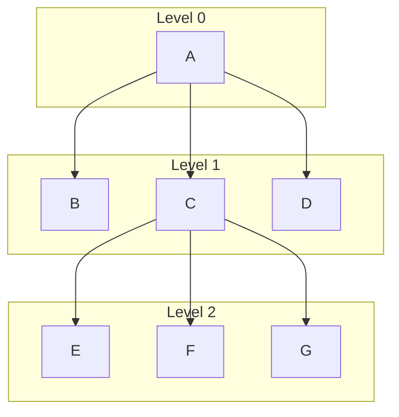

# Integration Testing Fundamentals

Integration testing happens after unit testing and focuses on testing the **interfaces** and interactions between different software **modules** as they are combined.

## 1. Core Concepts

- **Module**: A self-contained piece of software, like a single function or method.
- **Interface**: The connection that lets modules pass **control** (calling a function) and **data** (parameters, shared variables) to each other. A significant number of software faults occur here.
- **Scaffolding**: Temporary, dummy code used to fill in for missing modules during testing.
- **Test Stub**: A dummy module that is **called by** the component you are testing. It simply provides a pre-programmed response. It's used heavily in **Top-Down Integration**.
- **Test Driver**: A dummy module that **calls** the component(s) you are testing. It sets up and starts the test. It's used heavily in **Bottom-Up Integration**.

## 2. Classical Integration Strategies

These strategies are used for systems with a clear hierarchical design (like a tree structure).

- **Top-Down Integration**: Starts at the top (module `A`) and works down. It requires creating **stubs** for all lower-level modules that haven't been integrated yet.
- **Bottom-Up Integration**: Starts at the bottom-most modules (`E`, `F`, `G`) and works up. It requires creating **test drivers** to simulate the calls from the upper-level modules.
- **Sandwich Testing**: A hybrid approach that combines top-down and bottom-up strategies. Testing proceeds from both the top and bottom levels simultaneously, meeting in the middle layers.
- **Big Bang Testing**: All modules are combined at once and tested together. This is **not recommended** for large systems because it's very hard to pinpoint the source of a fault when something goes wrong.
