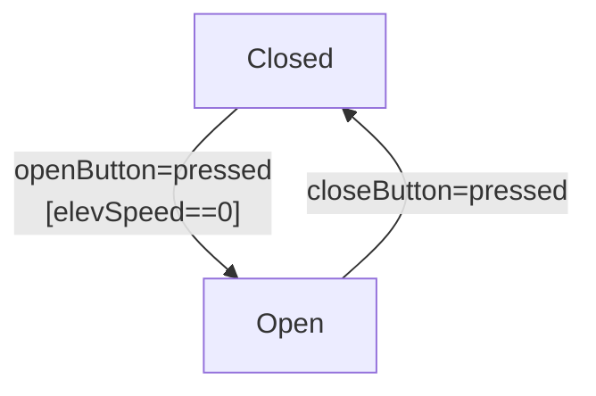

# Testing Specifications and Finite State Machines

Testing also involves verifying design rules, like the correct order of method calls. These rules are called **sequencing constraints**.

## 1. Sequencing Constraints

- These are rules that prevent logical errors (e.g., `open()` must be called before `write()`).
- The goal of testing is to **actively find violations**. The tests themselves are **sequences of method calls** designed to exercise these rules.

## 2. Finite State Machines (FSMs)

For more complex, state-based behavior, we use **Finite State Machines (FSMs)**.

- **Key Distinction**: A **Control Flow Graph (CFG) is NOT a Finite State Machine**. This is a critical concept.
  - A CFG shows the possible **paths of execution**.
  - An FSM shows the possible **states** of the system. A state is defined by the **values of variables**. Transitions between states happen when those values change.

- **FSM Components**:
  - **Nodes**: Represent the **States** of the system (e.g., `ElevatorDoorClosed`, `QueueIsEmpty`).
  - **Edges**: Represent **Transitions** that change the state, often triggered by method calls.
  - **Pre-conditions (Guards)**: Conditions that **must be true** for a transition to be taken (e.g., an elevator's speed must be zero before the door can open).

- **Applying Graph Coverage to FSMs**:
  - **Node Coverage** -> Test every **State**.
  - **Edge Coverage** -> Test every **Transition**.

