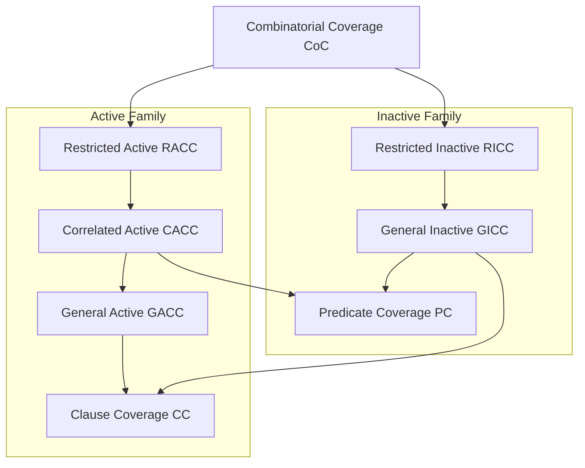

# Active and Inactive Clause Coverage

## 1. Active Clause Coverage (ACC)

For each clause, test it as True and False under conditions where it **determines** the predicate.

**The idea**: We want to prove that each clause actually matters by showing it can change the outcome.

### Three Variants (The Rules for Other Clauses)

When testing a major clause, what about the other clauses (minor clauses)? Three different rules:

**General ACC (GACC)**:
- Minor clauses can have different values in the two tests.
- Does NOT subsume PC.
- Easiest to satisfy.
- **Example**: For $P = a \wedge b$, testing clause $a$:
  - Test 1: $a = True, b = True$ → $P = True$
  - Test 2: $a = False, b = False$ → $P = False$
  - Minor clause $b$ changed from True to False. That's allowed in GACC.

**Restricted ACC (RACC)**:
- Minor clauses must have the SAME values in both tests.
- Strongest, but sometimes impossible.
- **Example**: For $P = a \wedge b$, testing clause $a$:
  - Test 1: $a = True, b = True$ → $P = True$
  - Test 2: $a = False, b = True$ → $P = False$
  - Minor clause $b$ stays True in both tests. This is RACC.

**Correlated ACC (CACC)**:
- Minor clauses can vary, BUT the predicate must be True for one test and False for the other.
- Subsumes PC.
- Most practical.
- **Example**: For $P = a \wedge b$, testing clause $a$:
  - Test 1: $a = True, b = True$ → $P = True$
  - Test 2: $a = False, b = False$ → $P = False$
  - Minor clause $b$ changed, but the key is: $P$ went from True to False. This is CACC.

### How to Find Test Pairs (The Algorithm)

For any clause $c$ in predicate $P$:

**Step 1**: Find the determination condition using XOR formula: $P_c = P_{c=true} \oplus P_{c=false}$

**Step 2**: Find candidate rows from the truth table:
- **Set T**: All rows where $c = True$ AND $P_c$ is True
- **Set F**: All rows where $c = False$ AND $P_c$ is True

**Step 3**: Create pairs based on the criterion:
- **GACC Pairs**: Any combination from Set T × Set F
- **RACC Pairs**: Only GACC pairs where minor clauses are identical
- **CACC Pairs**: Only GACC pairs where $P$ is True in one row and False in the other

### Complete Example: $P = (a \vee b) \wedge c$

**Step 1**: Use the XOR formula to find determination conditions:
- $P_a = \neg b \wedge c$ → $a$ determines $P$ when $b = False$ AND $c = True$
- $P_b = \neg a \wedge c$ → $b$ determines $P$ when $a = False$ AND $c = True$
- $P_c = a \vee b$ → $c$ determines $P$ when $a = True$ OR $b = True$

**Step 2**: Create test pairs for each clause (GACC approach):

**Testing clause $a$** (set $b = False, c = True$ so $a$ determines $P$):
- Test 1: $a = True, b = False, c = True$ → $P = (True \vee False) \wedge True = True$
- Test 2: $a = False, b = False, c = True$ → $P = (False \vee False) \wedge True = False$
- Flipping $a$ flipped the result.

**Testing clause $b$** (set $a = False, c = True$ so $b$ determines $P$):
- Test 3: $b = True, a = False, c = True$ → $P = (False \vee True) \wedge True = True$
- Test 4: $b = False, a = False, c = True$ → $P = (False \vee False) \wedge True = False$
- Test 4 is the same as Test 2.

**Testing clause $c$** (set $a = True$ or $b = True$ so $c$ determines $P$):
- Test 5: $c = True, a = True, b = True$ → $P = (True \vee True) \wedge True = True$
- Test 6: $c = False, a = True, b = True$ → $P = (True \vee True) \wedge False = False$
- Flipping $c$ flipped the result.

**Final Test Set** (removing duplicates):
1. $(a = True, b = False, c = True)$ → True
2. $(a = False, b = False, c = True)$ → False
3. $(a = False, b = True, c = True)$ → True
4. $(a = True, b = True, c = False)$ → False

**What we achieved**: 4 tests that cover all three clauses under conditions where each one actually matters.

## 2. Inactive Clause Coverage (ICC)

Tests that a clause does NOT affect the predicate under certain conditions.

**The opposite of ACC**: Instead of proving a clause matters, we prove it doesn't matter in certain situations.

**Requirements**: For each clause, test all four scenarios:
1. P is True and clause is True
2. P is True and clause is False
3. P is False and clause is True
4. P is False and clause is False

**Why it matters**: Sometimes you need to verify that changing something doesn't affect the outcome.

**Simple example**: "In Manual Mode, the system ignores the temperature sensor."
- You need tests showing: Manual Mode ON + Sensor High = Same result
- And: Manual Mode ON + Sensor Low = Same result
- This proves the sensor is inactive in Manual Mode.

### Quick Example: $P = a \wedge b$

Can clause $a$ be inactive?

**When $P = True$**: 
- Need $a = True, b = True$ → $P = True$
- Need $a = False, b = ?$ → Can't make $P = True$ when $a = False$
- So $a$ cannot be inactive when $P = True$.

**When $P = False$**:
- Need $a = True, b = False$ → $P = False$
- Need $a = False, b = True$ → $P = False$
- So $a$ CAN be inactive when $P = False$.

### Variants

- **GICC**: Minor clauses can vary.
- **RICC**: Minor clauses must be identical.
- **CICC**: Does NOT exist (logical contradiction).

## 3. Subsumption Hierarchy

**Key points**:
- CoC is strongest (but infeasible)
- CACC subsumes PC (important!)
- GACC does NOT subsume PC

## 4. Infeasibility (When Tests Are Impossible)

Real-world constraints can make some test combinations physically impossible.

**Example**: "The valve must be open when in Operational mode" (system constraint)
- You want to test: `mode=Operational, valve=Closed`
- But the system won't let you! This combination is **infeasible**.

**What to do**: Fall back to weaker criteria:
1. Try RACC
2. If impossible → try CACC
3. If still impossible → try GACC

