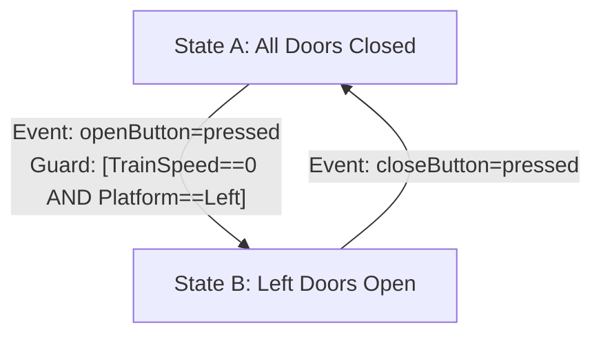

# Logic in Specifications

Logic coverage applies to requirements (SRS), design documents, and functional specifications (FRS), not just source code.

## 1. Finding Logic in Specifications

**The Process**: Read English requirements and translate them into formal logical predicates.

**Why this matters**: Requirements are written in English, which is ambiguous. Translating to logic makes them precise and testable.

### Common Locations

**Preconditions**: Conditions that must be true before a method runs.
- Example: "User must be logged in before viewing profile"
- Predicate: $isLoggedIn = True$

**Postconditions**: Conditions that must be true after a method runs.
- Example: "After withdrawal, balance must be non-negative"
- Predicate: $balance \geq 0$

**Invariants**: Conditions that must always be true.
- Example: "Queue size is never negative"
- Predicate: $queueSize \geq 0$

### Translation Example

**English requirement**: "Pincode must be 6 digits"

**How to translate**:
- 6 digits means the number is between 000000 and 999999
- "Must be" means AND (both conditions must hold)
- Predicate: $(pincode \geq 000000) \wedge (pincode \leq 999999)$

**Another example**: "User can access admin panel if they are an admin OR a superuser"
- Predicate: $isAdmin \vee isSuperuser$

**Complex example**: "Discount applies if order is over 100 dollars AND (customer is premium OR it's a holiday)"
- Predicate: $(orderTotal > 100) \wedge (isPremium \vee isHoliday)$

## 2. Normal Forms (Testing Shortcuts)

When a predicate is in a normal form, there are simple patterns for applying ACC. These are huge time-savers.

### Conjunctive Normal Form (CNF)

**Structure**: AND of ORs, like $(clause1) \wedge (clause2) \wedge (clause3)$
- Think of it as: "All of these conditions must be true"
- Common for lists of preconditions

**Example**: "To book a flight, you must have a valid passport AND sufficient funds AND available seats"
- Predicate: $hasPassport \wedge hasFunds \wedge seatsAvailable$
- This is CNF (just ANDs, no ORs in this simple case)

**ACC Shortcut**: To test a major clause, set all other minor clauses to True.

**Why this works**: In an AND, a clause only matters when all other clauses are True. If any other clause is False, the whole thing is False regardless of your major clause.

**Test pattern** (requires $n + 1$ tests, where $n$ is the number of clauses):
- One "all-trues" case: $(T, T, T)$
- A "diagonal of falses": $(F, T, T)$, $(T, F, T)$, $(T, T, F)$

**Example for 3 clauses**:
1. $(True, True, True)$ → All conditions met
2. $(False, True, True)$ → First clause fails
3. $(True, False, True)$ → Second clause fails
4. $(True, True, False)$ → Third clause fails

**What you're testing**: Each test shows one clause determining the outcome (making it fail) while others are satisfied.

### Disjunctive Normal Form (DNF)

**Structure**: OR of ANDs, like $(clause1) \vee (clause2) \vee (clause3)$
- Think of it as: "At least one of these conditions must be true"

**Example**: "You can log in with password OR fingerprint OR face recognition"
- Predicate: $hasPassword \vee hasFingerprint \vee hasFaceID$
- This is DNF (just ORs)

**ACC Shortcut**: To test a major clause, set all other minor clauses to False.

**Why this works**: In an OR, a clause only matters when all other clauses are False. If any other clause is True, the whole thing is True regardless of your major clause.

**Test pattern** (requires $n + 1$ tests, where $n$ is the number of clauses):
- One "all-falses" case: $(F, F, F)$
- A "diagonal of trues": $(T, F, F)$, $(F, T, F)$, $(F, F, T)$

**Example for 3 clauses**:
1. $(False, False, False)$ → All conditions fail
2. $(True, False, False)$ → First clause succeeds
3. $(False, True, False)$ → Second clause succeeds
4. $(False, False, True)$ → Third clause succeeds

**What you're testing**: Each test shows one clause determining the outcome (making it succeed) while others fail.

### The $n + 1$ Rule

Both CNF and DNF shortcuts follow the same pattern: **$n + 1$ tests for $n$ clauses**.

**Why this is powerful**:
- For a 5-clause predicate, you only need 6 tests (instead of potentially many more with the general algorithm)
- For a 10-clause predicate, you only need 11 tests
- This only works for pure CNF or pure DNF predicates

**When you can't use it**:
- Mixed predicates like $(a \wedge b) \vee (c \wedge d)$ need the full algorithm from Week 5
- Predicates with complex nesting need the XOR formula approach

### Quick Recognition

**How to spot CNF**: Top-level operator is AND
- $(A \vee B) \wedge (C \vee D) \wedge E$ → CNF

**How to spot DNF**: Top-level operator is OR
- $(A \wedge B) \vee (C \wedge D) \vee E$ → DNF

## 3. Logic in Finite State Machines (FSMs)

Logic coverage combines with graph coverage when testing FSM specifications.

**FSMs as Specifications**: Formal way to specify system behavior with states, events, and transitions.

**Guards as Predicates**: A guard is a logical condition on a transition. The transition only happens if the guard is True.

**Think of it like this**: A guard is like a bouncer at a club. The transition (entering the club) only happens if the guard's conditions are met.

### Testing Strategy

**Step 1**: Use Graph Coverage (like Edge Coverage) to select a transition to test.
- This tells you which transition you're testing.

**Step 2**: Use Logic Coverage (like CACC) to test the guard on that transition.
- This tells you what test cases you need for that guard.

### Example: Train Door System

**The guard**: $(TrainSpeed = 0) \wedge (Platform = Left)$

**Applying CACC to this guard**:

For clause $TrainSpeed = 0$:
- Test 1: $TrainSpeed = 0, Platform = Left$ → Guard is True, doors open
- Test 2: $TrainSpeed \neq 0, Platform = Left$ → Guard is False, doors stay closed

For clause $Platform = Left$:
- Test 3: $TrainSpeed = 0, Platform = Left$ → Guard is True, doors open (same as Test 1)
- Test 4: $TrainSpeed = 0, Platform \neq Left$ → Guard is False, doors stay closed

**Final test set**: 3 unique tests covering both clauses.

## 4. Finding Specification Flaws

Applying logic coverage to specifications is model-based testing that finds flaws before code is written.

**The power**: When you try to create test cases and find one is infeasible, you've discovered a flaw in the specification itself.

### Real Example: Subway Train FSM

**The scenario**:
- A complex guard with 6 clauses controlled the "Open Left Doors" transition.
- While creating CACC test cases, one test requirement was infeasible.

**The infeasible test**:
- Required $Location$ to be "In Station" AND "In Tunnel" simultaneously.
- This is physically impossible. A train can't be in a station and in a tunnel at the same time.

**What this means**:
- The specification has a logical contradiction.
- Either:
  - The guard is wrong (has unnecessary clauses)
  - The state model is wrong (missing states or transitions)
  - The requirements are incomplete

**Why this is valuable**:
- Found in the design phase (cheap to fix)
- If found in code (expensive to fix)
- If found in production (very expensive, possibly dangerous)

**The lesson**: Infeasible test requirements aren't just annoying. They're proof that something is wrong with the specification. Document them and investigate.
