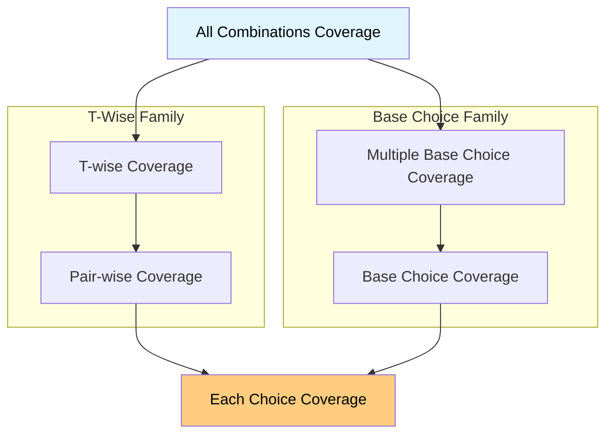

# Input Space Partitioning (ISP)

## 1. What is ISP?

ISP is the core technique of functional testing. It's how we divide the entire input domain into a manageable set of "equivalence classes" to test.

### I. The Two Rules of a Valid Partition

A valid partition of a set (the input domain) must follow two strict rules:

- **1. Disjoint**: Partitions **must not overlap**. An input can only belong to one partition.

- **2. Complete**: All partitions added together **must cover the entire domain**. No input value can be left out.

- **Think of it like this**: Dividing a pizza. Every slice must be separate (disjoint), and all slices together must make the whole pizza (complete).

### II. Characteristics

A **characteristic** is the "property" or "rule" used to create the partitions.

- **Flawed Example**: Partitioning a file by "Order" into:
  - $S_1$ = Ascending
  - $S_2$ = Descending
  - $S_3$ = Arbitrary

- **Why it's flawed**: A file with 0 or 1 element belongs to all three partitions. This violates the **disjoint** rule.

- **Fixed Example**: Partition by "Order" into:
  - $S_1$ = Strictly Ascending (each element > previous)
  - $S_2$ = Strictly Descending (each element < previous)
  - $S_3$ = Neither (everything else)
  - Now a file with 1 element only belongs to $S_3$.

## 2. The 4-Step ISP Process

This is the formal process for modeling the input domain.

- **Step 1: Identify Testable Functions**
  - What component are you testing?
  - Example: `findElement(List list, Object element)`

- **Step 2: Identify Parameters**
  - List all inputs and environmental factors that affect the function's behavior
  - Example: `list`, `element`

- **Step 3: Model the Domain**
  - Define characteristics and create partitions for each
  - This is the main step (covered in detail below)

- **Step 4: Select Test Values**
  - Choose values from the partitions to create test cases
  - Example: For partition "list is empty", choose a concrete value like `new ArrayList()`

## 3. Two Approaches to Modeling (Step 3)

There are two ways to decide how to create your partitions.

### I. Interface-Based Approach

- **How it works**: Looks at each input parameter **in isolation**.

- **Example**: `findElement(List list, Object element)`
  - Partitions for `list`:
    - list is null
    - list is not null
    - list is empty
    - list is not empty
  - Partitions for `element`:
    - element is null
    - element is not null

- **Strength**: Simple and easy to identify characteristics. You can do it just by looking at the method signature.

- **Weakness**: Often **misses bugs** that happen because of the interaction between parameters. For example, it doesn't test "element is in the list" vs "element is not in the list".

### II. Functionality-Based Approach

- **How it works**: Defines characteristics based on the **overall functionality** or behavior of the program.

- **Example**: `findElement(List list, Object element)`
  - It considers both inputs together.
  - A characteristic could be: "Number of occurrences of `element` in `list`"
  - Partitions:
    - Occurrences = 0 (not found)
    - Occurrences = 1 (found once)
    - Occurrences > 1 (found multiple times)

- **Strength**: Much more effective at finding bugs. Can be started early from requirements.

- **Weakness**: Harder to do. Requires domain knowledge to identify the right characteristics.

- **When to use which**:
  - Interface-Based: Quick first pass, simple functions
  - Functionality-Based: Important functions, when you understand requirements

## 4. ISP Coverage Criteria (Combining Partitions)

Once you have partitions for multiple inputs, how do you combine them into test cases?

**Example Setup**: 3 Inputs
- Input 1 Partitions: `{A, B}` (2 blocks)
- Input 2 Partitions: `{1, 2, 3}` (3 blocks)
- Input 3 Partitions: `{x, y}` (2 blocks)

### I. All Combinations Coverage (ACoC)

- **Definition**: Test **every possible combination** of blocks from all characteristics.

- **Example**: All 12 combinations:
  - With A:
    - `(A,1,x)`, `(A,1,y)`
    - `(A,2,x)`, `(A,2,y)`
    - `(A,3,x)`, `(A,3,y)`
  - With B:
    - `(B,1,x)`, `(B,1,y)`
    - `(B,2,x)`, `(B,2,y)`
    - `(B,3,x)`, `(B,3,y)`

- **Number of Tests**: Product of all block counts: $2 \times 3 \times 2 = 12$ tests

- **Evaluation**: 
  - Exhaustive but impractically large and expensive
  - The `trityp` example with 3 inputs of 4 blocks each required $4 \times 4 \times 4 = 64$ tests

### II. Each Choice Coverage (ECC)

- **Definition**: At least one value from every block must be used in at least one test case.

- **Number of Tests**: At least the size of the largest partition: $\max(2, 3, 2) = 3$ tests

- **Example**: A valid set is `{(A, 1, x), (B, 2, y), (A, 3, x)}`
  - What this covers:
    - From Input 1: 
      - A (in test 1 and 3)
      - B (in test 2)
    - From Input 2: 
      - 1 (in test 1)
      - 2 (in test 2)
      - 3 (in test 3)
    - From Input 3: 
      - x (in test 1 and 3)
      - y (in test 2)

- **Evaluation**: A minimal number of tests, but considered **very weak** as it misses most interactions.

### III. Pairwise Coverage (PWC) or T-Wise Coverage

- **Definition (PWC)**: Every pair of blocks from any two characteristics must be combined at least once.

- **What pairs do we need?**
  - From Input 1 and Input 2:
    - (A,1), (A,2), (A,3), (B,1), (B,2), (B,3)
  - From Input 1 and Input 3:
    - (A,x), (A,y), (B,x), (B,y)
  - From Input 2 and Input 3:
    - (1,x), (1,y), (2,x), (2,y), (3,x), (3,y)

- **Example Test Set**:
  1. `(A, 1, x)` 
     - Covers pairs: (A,1), (A,x), (1,x)
  2. `(A, 2, y)` 
     - Covers pairs: (A,2), (A,y), (2,y)
  3. `(B, 1, y)` 
     - Covers pairs: (B,1), (B,y), (1,y)
  4. `(B, 2, x)` 
     - Covers pairs: (B,2), (B,x), (2,x)
  5. `(A, 3, x)` 
     - Covers pairs: (A,3), (3,x)
  6. `(B, 3, y)` 
     - Covers pairs: (B,3), (3,y)

- **Definition (TWC)**: Generalizes this to groups of $T$ characteristics.
  - $T = 1$ is ECC
  - $T = 2$ is PWC
  - $T = N$ is ACoC

- **Evaluation**: PWC (T=2) is the practical "sweet spot." 
  - Much stronger than ECC
  - Much cheaper than ACoC
  - The `trityp` example was reduced from 64 tests to just 16

### IV. Base Choice Coverage (BCC)

- **Definition**: A focused approach:
  1. **Choose a "base choice"** (e.g., simplest or most common value) for each characteristic
  2. Form one **"base test"** using all base choices
  3. Create new tests by **varying one choice at a time** from the base test, keeping all others constant

- **Example**: Let base choices be `A`, `1`, `x`
  - **Step 1**: Create base test
    - Base Test: `(A, 1, x)`
  - **Step 2**: Vary each input one at a time
    - Vary Input 1:
      - `(B, 1, x)` - changed A to B
    - Vary Input 2:
      - `(A, 2, x)` - changed 1 to 2
      - `(A, 3, x)` - changed 1 to 3
    - Vary Input 3:
      - `(A, 1, y)` - changed x to y
  - **Step 3**: Count total tests
    - Total Tests: $1 + (1) + (2) + (1) = 5$ tests

- **Number of Tests Formula**: $1 + \sum (B_i - 1)$
  - Where $B_i$ is the number of blocks in characteristic $i$
  - In our example: $1 + (2-1) + (3-1) + (2-1) = 5$

- **Evaluation**: Intuitive and tests "what happens if I change just this one thing?" Good for finding bugs caused by a single unusual input.

### V. Multiple Base Choice Coverage (MBCC)

- **Definition**: An extension of BCC that allows you to select multiple base choices for each characteristic.

- **Example**: The `trityp` example used two base tests:
  - **Base Test 1**: `(2, 2, 2)` (equilateral triangle)
    - Variations from Base Test 1:
      - Vary side 1: `(1, 2, 2)`, `(3, 2, 2)`
      - Vary side 2: `(2, 1, 2)`, `(2, 3, 2)`
      - Vary side 3: `(2, 2, 1)`, `(2, 2, 3)`
  - **Base Test 2**: `(1, 2, 2)` (isosceles triangle)
    - Variations from Base Test 2:
      - Vary side 1: `(2, 2, 2)`, `(3, 2, 2)`
      - Vary side 2: `(1, 1, 2)`, `(1, 3, 2)`
      - Vary side 3: `(1, 2, 1)`, `(1, 2, 3)`

- **Evaluation**: More flexible than BCC; allows focusing on multiple important scenarios.

## 5. Subsumption Hierarchy

This diagram shows which criteria are stronger. An arrow from A to B means A "subsumes" B (if you satisfy A, you automatically satisfy B).

**Key points**:
- ACoC is strongest (but most expensive)
- ECC is weakest (but cheapest)
- PWC and BCC are separate families (neither subsumes the other)

## 6. Infeasible Test Requirements

- **The Problem**: Sometimes, a combination of blocks is **logically or physically impossible**.

- **Example**:
  - Characteristic A: List Length
    - $A_1$ = List has length 1
    - $A_2$ = List has length > 1
  - Characteristic B: Element Occurrences
    - $B_1$ = Element not found
    - $B_2$ = Element found once
    - $B_3$ = Element found more than once
  - **The infeasible combination**: $(A_1, B_3)$ - "List has length 1, element found more than once"
    - This is **infeasible**. You cannot find an element more than once in a list of length one.

### I. How to Handle Infeasibility

- **With ACoC / PWC**: 
  - You must simply **drop** the infeasible combinations from your test set

- **With BCC / MBCC**: 
  - These are more flexible
  - You can be smart and choose **base choices** that are not part of known infeasible combinations
  - **Example**: If you know $(A_1, B_3)$ is infeasible, don't choose $A_1$ as your base choice for Characteristic A

- **Best Practice**:
  - Always document which combinations are infeasible and why
  - This helps explain why your test count is lower than expected
