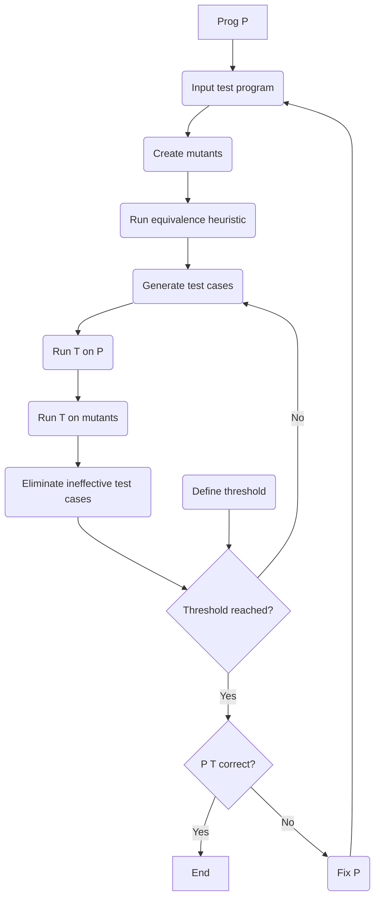

# Mutation Testing Basics

## 1. What is Mutation Testing?

Mutation testing is a powerful, syntax-based technique used to **evaluate the quality of a test suite**.

- **The Core Idea**: We intentionally introduce small, single faults (mutations) into our program and then check if our existing test suite can "catch" them.

- **The Goal**: The goal is **not** to find new bugs in the original program, but to find **weaknesses in the test suite** (i.e., tests you *failed* to write).

- **Think of it like this**: You're grading your own tests. If you introduce a bug and your tests don't catch it, your tests aren't good enough.

## 2. Key Definitions

- **Ground String**: The original, correct program or software artifact.

- **Mutation Operator**: A rule that defines a small, syntactic change to mimic a common programmer error.
  - *Example*: Change `>` to `>=` (Relational Operator Replacement).

- **Mutant**: The new, faulty program created after applying **exactly one** mutation operator to the ground string. It must be a program that still compiles.

## 3. The Mutation Testing Process

- **Step 1: Create Mutants**
  - Start with the original program (P) and apply mutation operators to generate a large set of faulty versions (P', P'', ...).

- **Step 2: Run Tests**
  - Take your existing test suite (T) and run it against both the original program (P) and *every single mutant*.

- **Step 3: Analyze Results**
  - For each mutant:
    - **Mutant is KILLED**: A test case *passes* on P but *fails* on the mutant. This is **GOOD**. It means your test suite found the fault.
    - **Mutant LIVES**: The test case produces the *same output* for both P and the mutant. This is **BAD**. It means your test suite has a "blind spot" and could not detect this fault.

### The Mutation Score

The final "grade" for your test suite is the **Mutation Score**.

- **Mutation Score** = $\frac{\text{Number of Mutants Killed}}{\text{Total Number of Mutants} - \text{Number of Equivalent Mutants}} \times 100\%$

- A high score (e.g., > 90%) means you have a very strong, thorough test suite.

## 4. Categories of Mutants

When you generate mutants, they fall into four categories:

### I. Stillborn Mutants

Mutants that are syntactically invalid and **fail to compile**. These are useless and are immediately discarded.

### II. Trivial Mutants

Mutants that are *so* faulty that **almost any test case** will kill them. They are also not useful because they don't challenge the test suite.

### III. Equivalent Mutants

This is the biggest problem. An equivalent mutant is syntactically different but **functionally identical** to the original program.

- *Example*: `x = x + 0;` is mutated to `x = x - 0;`.
- These mutants **cannot be killed** because their output is always the same as the original. They must be found (often manually) and removed from the total count, as they unfairly lower the mutation score.

### IV. Dead Mutants

These are the **useful** mutants. They are valid (compile) and *can* be killed by a good test case.

## 5. Strong vs. Weak Killing (The RIPR Model)

To "kill" a mutant, a test must trigger a chain of events. The level of killing measures how far down this chain your test gets.

- **Reachability**: The test case must *execute* the line of code that was mutated.

- **Infection**: The test must cause the program's *internal state* to be different immediately after the mutated statement (e.g., a variable holds the wrong value).

- **Propagation**: The "infected" state (the wrong value) must spread and cause a later part of the program, like the final return value, to also be incorrect.

- **Reveal**: The incorrect final output must be different from the original program's output, and the test must check for this (e.g., an assertion fails).

### I. Weak Mutation Coverage (Weak Killing)

- **Definition**: A test *weakly kills* a mutant if it satisfies **Reachability** and **Infection**.

- **Goal**: We just check that the internal state is wrong *immediately* after the mutation. We don't care if it propagates to the end.

- **Example**: The `isEven()` program.

```java
boolean isEven(int X) {
    if (X < 0) {
        X = 0 - X;      // <-- Original Line
        // ---------------------------------
        // X = 0;       // <-- Mutant Line (Δ4)
    }
    if ((float)(X/2) == ((float)X) / 2.0) {
        return(true);
    } else {
        return(false);
    }
}
```

- **Test Case**: `X = -6`
  - **Reachability**: `X < 0` is true, so line 4 is reached.
  - **Infection**:
    - Original program state: `X` becomes `6`.
    - Mutant program state: `X` becomes `0`.
    - The state is different (`6 != 0`), so **infection occurred**. This is a **weak kill**.
  - **Propagation (Fails)**: The rest of the program checks if `X` is even. Both `6` and `0` are even, so both versions return `true`. The infection did *not* propagate.

### II. Strong Mutation Coverage (Strong Killing)

- **Definition**: A test *strongly kills* a mutant if it satisfies all four conditions: **Reachability, Infection, Propagation, and Reveal**.

- **Goal**: The final, observable output of the program *must* be different.

- **Example**: The `isEven()` program.
  - **Test Case**: `X = -7` (an odd, negative integer)
  - **Reachability**: `X < 0` is true, so line 4 is reached.
  - **Infection**:
    - Original program state: `X` becomes `7`.
    - Mutant program state: `X` becomes `0`.
    - State is different (`7 != 0`).
  - **Propagation & Reveal**:
    - Original (`X=7`): `isEven(7)` returns `false`.
    - Mutant (`X=0`): `isEven(0)` returns `true`.
    - The final output is different (`false != true`), so this is a **strong kill**.

---

## Mutation Testing Process Diagram


